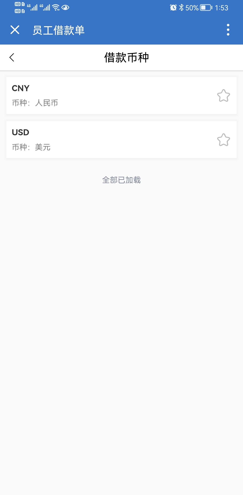
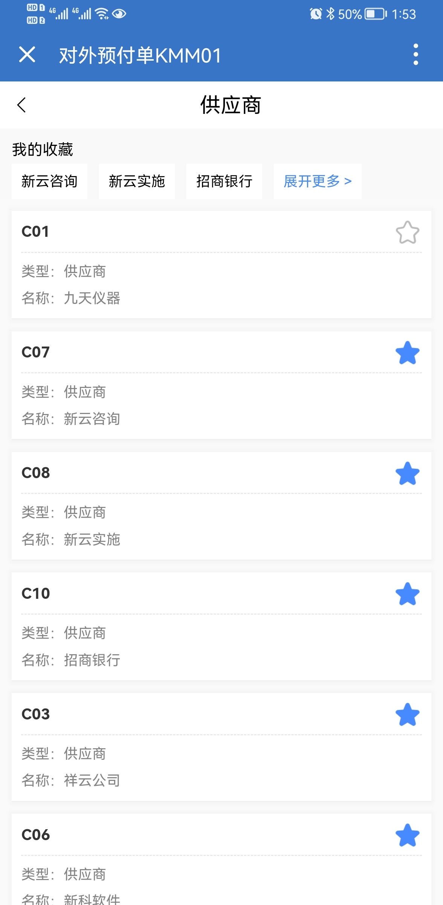

<!--
 * @Author: 李韬
 * @Date: 2022-08-29 17:52:38
 * @LastEditors: 李韬
 * @LastEditTime: 2022-08-30 13:56:05
-->
## 弹出选择框的两种样式

## 双击查看全部
<video width="313" height="640" controls>
  <source src="../videos/video1.mp4" type="video/mp4">
您的浏览器不支持 video 标签。
</video>

## 收藏
<video width="313" height="640" controls>
  <source src="../videos/video2.mp4" type="video/mp4">
您的浏览器不支持 video 标签。
</video>

## 多选
<video width="313" height="640" controls>
  <source src="../videos/video3.mp4" type="video/mp4">
您的浏览器不支持 video 标签。
</video>